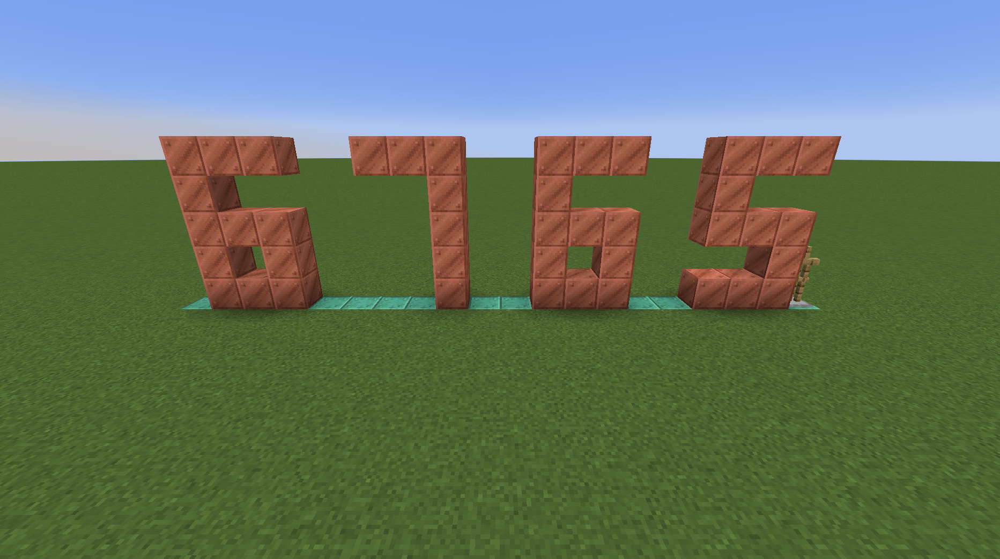

# Installation

1. Copy the datapack in your world's 'datapacks' folder.
2. Run `/reload` or rejoin your world

# Settings

You can tweak the settings of the computer with the command `/function cb_computer:settings`.
This will print out a list of parameters that you can modify.

| Setting | Default value | Description |
| :--- | :---: | :--- |
| `opcode_len` | 6 | Length of opcode in bit. This should be the value used in [the compiler script](cb_computer/data/cb_computer/functions/programs/converter.py) |
| `instruction_len` | 16 | Length of instructions in bit. This should be the value used in [the compiler script](cb_computer/data/cb_computer/functions/programs/converter.py) |
| `output_chat` | 0 | Whether the `OUT` instruction prints in chat (either 0 or 1). |
| `debug_instructions` | 0 | Whether instructions are printed in chat when executed (either 0 or 1). |
| `max_digits` | 15 | Maximum number of digits displayed on physical displays. |
| `debug_warnings` | 0 | Whether warnings should be printed in chat (either 0 or 1). |
| `speed` | 1000 | Delay between each instruction execution in ms (possible values are: 50, 100, 200, 500, 1000). |

# Physical displays

To show the output of a program, you can turn `output_chat` on and/or place physical displays. The former has been covered above. For the latter, run `/function cb_computer:give/output` to get an output display. Place it on the ground. When a value is output by a program, the digits will be placed in the positive X direction (east) like this.

To remove a display, simply destroy the armour stand.

NB: you can have multiple displays, in which case they will all show the same value

# Running a program

1. Run `/reload` or `/function cb_computer:load` to reset the computer's memory.
2. Run the corresponding function, for example `/function cb_computer:programs/fibonacci`.
3. Run `/function cb_computer:exec`.

To stop the execution manually, run `/function cb_computer:stop`.
